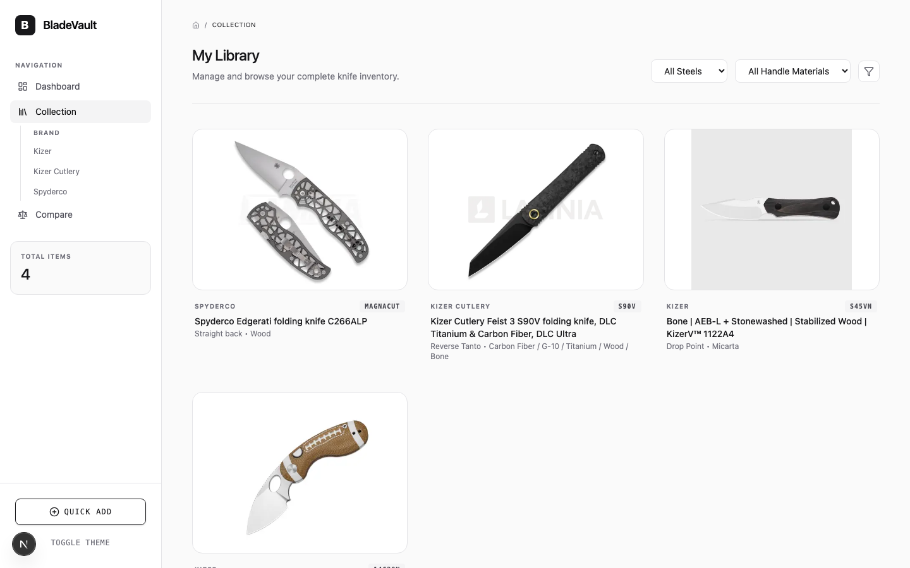
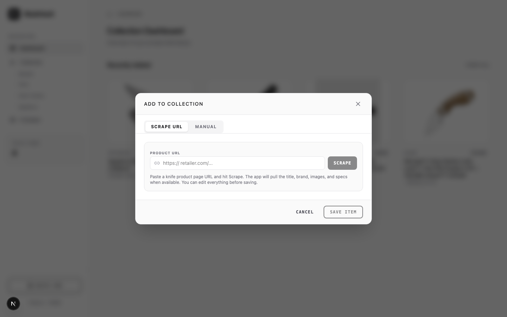

<div align="center">

  

  <h1>BladeVault</h1>
  <p>
    <strong>A sharp, local-first knife collection manager.</strong>
  </p>

  <p>
    
    
    
    
    
    
  </p>

  <p>
    
    
    
    
  </p>

</div>

---

## ✨ Features

- **Dashboard** — Get a quick overview of your recently added knives.
- **Collection Library** — Browse your complete inventory with brand filters and sorting controls.
- **Knife Detail Page** — View specifications, descriptions, and a full image gallery with lightbox navigation.
- **Inline Editing** — Update any knife's details directly from the detail page.
- **Comparison Tool** — Select up to 3 knives and compare specs side-by-side.
- **Smart URL Scraping** — Paste a product URL and BladeVault auto-fetches title, brand, images, steel, and specs.
  - Includes special handling for **Shopify** stores via their `.json` product endpoint.
  - Uses **Playwright** for JavaScript-rendered pages.
- **Manual Entry** — Add knives by hand with a clean, structured form.
- **Image Management** — Downloaded images are stored locally or uploaded to Cloudflare R2; fallback placeholders keep the UI tidy.
- **Dark & Light Mode** — Toggle themes instantly from the sidebar.
- **Local-First Storage** — SQLite database + local image folder. Your data stays on your machine by default.
- **Optional Cloudflare Sync** — Switch to remote mode to store knives in **Cloudflare D1** and images in **Cloudflare R2**.

---

## 📸 Screenshots

<div align="center">

  
  <p><sub>Dashboard — recently added knives at a glance</sub></p>

  <br />

  
  <p><sub>Collection Library — browse and filter your entire inventory</sub></p>

  <br />

  
  <p><sub>Knife Detail — specs, description, and image gallery</sub></p>

  <br />

  
  <p><sub>Compare — side-by-side specification comparison</sub></p>

  <br />

  
  <p><sub>Quick Add — scrape a product URL or enter details manually</sub></p>

</div>

---

## 🚀 Tech Stack

| Layer | Technology |
|-------|------------|
| Framework | [Next.js 15](https://nextjs.org/) with App Router |
| UI | [React 19](https://react.dev/), [TypeScript](https://www.typescriptlang.org/) |
| Styling | [Tailwind CSS 4](https://tailwindcss.com/), [Lucide Icons](https://lucide.dev/) |
| Local Database | [better-sqlite3](https://github.com/WiseLibs/better-sqlite3) |
| Remote Database | [Cloudflare D1](https://developers.cloudflare.com/d1/) |
| Remote Object Storage | [Cloudflare R2](https://developers.cloudflare.com/r2/) |
| Scraping | [Playwright](https://playwright.dev/) + [Cheerio](https://cheerio.js.org/) |
| Animations | [Motion](https://motion.dev/) |

---

## 📦 Installation

> **Prerequisite:** Node.js 20+

```bash
# 1. Clone the repository
git clone https://github.com/yourusername/bladevault.git
cd bladevault

# 2. Install dependencies
npm install

# 3. Install Playwright browsers (needed for scraping)
npx playwright install chromium

# 4. Start the development server
npm run dev
```

Open [http://localhost:3000](http://localhost:3000) in your browser.

---

## 🐳 Run with Docker

A Dockerfile is included with Playwright browsers pre-installed.

```bash
# Build the image
docker build --no-cache -t bladevault .

# Run with persistent data volume
docker run -p 5500:3000 -d \
  --name bladevault \
  --restart unless-stopped \
  -v $(pwd)/data:/app/data \
  bladevault
```

The `-v $(pwd)/data:/app/data` mount preserves the SQLite database and downloaded images between runs.

Or use Docker Compose for a cleaner one-command setup:

```bash
docker compose up -d
```

---

## 🛠 Available Scripts

| Command | Description |
|---------|-------------|
| `npm run dev` | Start the local development server |
| `npm run build` | Create a production build |
| `npm run start` | Serve the production build |
| `npm run lint` | Run ESLint across the repo |
| `npm run clean` | Clear Next.js build artifacts |

---

## 📁 Project Structure

```
bladevault/
├── app/                  # Next.js App Router routes
│   ├── page.tsx          # Dashboard
│   ├── collection/       # Collection list & detail pages
│   ├── compare/          # Knife comparison page
│   └── api/              # REST API routes (knives, scrape, images, settings)
├── components/           # Reusable React components
│   ├── providers/        # React context providers
│   ├── add-knife-modal.tsx
│   ├── knife-card.tsx
│   ├── knife-detail.tsx
│   ├── gallery.tsx
│   ├── settings-modal.tsx
│   └── sidebar.tsx
├── lib/                  # Utilities, storage backends, and scrapers
│   ├── local-db.ts       # Local SQLite connection
│   ├── settings.ts       # App settings + Cloudflare credential storage
│   ├── storage/          # Storage abstraction (local + Cloudflare remote)
│   ├── scrape.ts
│   ├── scrape-playwright.ts
│   └── data.ts           # Shared types
├── data/                 # SQLite DB + downloaded images (created at runtime)
├── public/               # Static assets
├── Dockerfile
├── next.config.ts
├── package.json
└── tsconfig.json
```

---

## 💾 Data Storage

### Local mode (default)

BladeVault stores everything locally:

- **SQLite database:** `data/bladevault.sqlite`
- **Downloaded images:** `data/images/`

No cloud accounts or API keys required. Keep the `data/` folder backed up to preserve your collection.

### Remote mode (Cloudflare)

Open **Settings** from the sidebar and switch to **Remote**. Knives and images will be stored in:

- **Cloudflare D1** — serverless SQL database for knife records.
- **Cloudflare R2** — S3-compatible object storage for images.

Required Cloudflare resources:

1. A D1 database and its **Database ID**.
2. A public R2 bucket and its **public bucket URL**.
3. Your Cloudflare **Account ID**.
4. An API token with `Account → D1 → Edit` permission.
5. An R2 API token with `Object Read & Write` permission for your bucket.

After entering credentials, use **Test D1** / **Test R2** to verify the connection, then click **Migrate Local → Remote** to copy existing local knives and images to Cloudflare. Your local data is preserved.

---

## ☁️ Cloudflare Setup Checklist

If you plan to use BladeVault with Cloudflare remote storage, make sure you have the following resources ready before switching to Remote mode in Settings:

1. **D1 Database** — Create a D1 database and copy its **Database ID**.
2. **R2 Bucket** — Create an R2 bucket, make it **public**, and copy the public bucket URL.
3. **Account ID** — Copy your Cloudflare **Account ID**.
4. **D1 API Token** — Create an API token with **Account → D1 → Edit** permission.
5. **R2 API Token** — Create an R2 API token with **Object Read & Write** permission for your bucket.

After entering credentials in Settings, use **Test D1** / **Test R2** to verify the connection, then click **Migrate Local → Remote** to copy existing local knives and images to Cloudflare. Your local data is preserved.

---

## 🤝 Contributing

Contributions are welcome. Please keep changes focused and run the verification gates before submitting:

```bash
npm run lint
npm run build
```

---

## 📄 License

This project is open source and available under the [MIT License](LICENSE).

---

<div align="center">
  <sub>Built with precision for knife enthusiasts.</sub>
</div>
