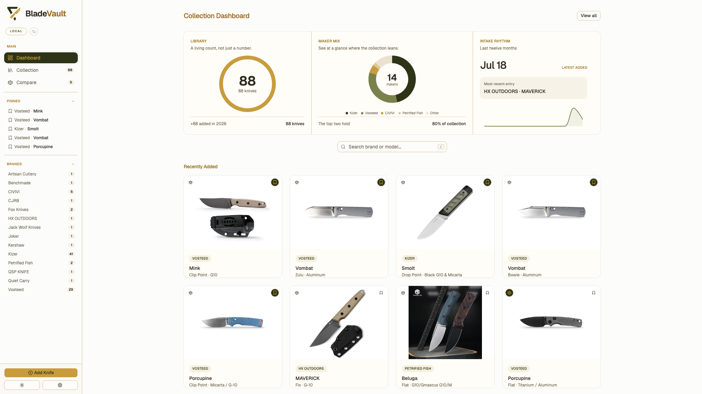
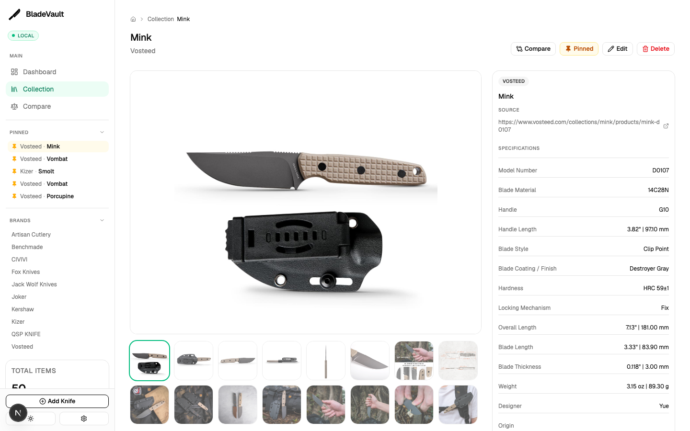
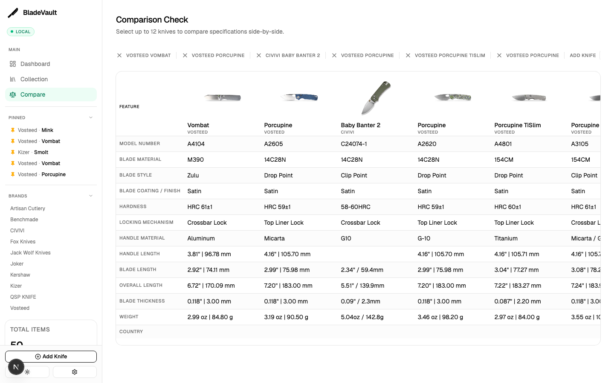
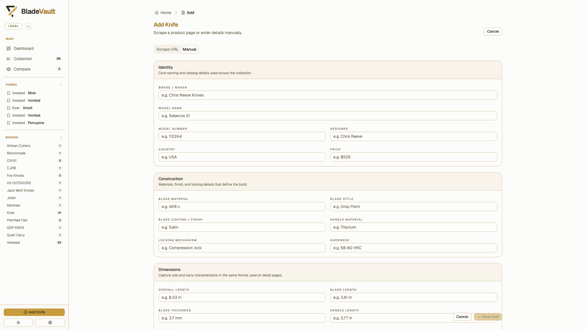

<div align="center">

  

  <h1>BladeVault</h1>
  <p>
    <strong>A sharp, local-first knife collection manager.</strong>
  </p>

  <p>
    Track your collection, compare knives side by side, export clean PDFs, and keep full control of your data with local SQLite storage and optional cloud backup.
  </p>

  <p>
    
    
    
    
    
    
  </p>

  <p>
    
    
    
    
    
  </p>

</div>

---

## Quick Start

Choose the fastest path for how you want to use BladeVault:

- **Docker**: `docker compose up -d --build`
- **Source**: `npm install` then `npx playwright install chromium` and `npm run dev`
- **Desktop shell**: `npm run desktop:dev`

If you only want to try the app, Docker is the quickest setup. If you want to develop or customize it, run from source.

---

## ✨ Features

- **Dashboard** — Get a quick overview of your recently added knives.
- **Collection Library** — Browse your complete inventory with searchable multi-select filters across brand, model number, blade material, blade style, coating, hardness, locking mechanism, handle material, handle length, blade length, overall length, blade thickness, weight, and country.
- **Knife Detail Page** — View specifications, descriptions, and a full image gallery with lightbox navigation.
- **Inline Editing** — Update any knife's details directly from the detail page.
- **Comparison Tool** — Select up to 3 knives and compare specs side-by-side.
- **PDF Export** — Export knife details and comparison views as PDF files for sharing or archiving.
- **Print Support** — Use print-friendly layouts to generate clean hard copies of knife records.
- **Smart URL Scraping** — Paste a product URL and BladeVault auto-fetches title, brand, images, steel, and specs.
  - Includes special handling for **Shopify** stores via their `.json` product endpoint.
  - Uses **Playwright** for JavaScript-rendered pages.
- **Manual Entry** — Add knives by hand with a clean, structured form.
- **Image Management** — Downloaded images are stored locally; cloud backup can sync them to the BladeVault backend when you want an off-device copy.
- **Dark & Light Mode** — Toggle themes instantly from the sidebar.
- **Local-First Storage** — SQLite database + local image folder. Your data stays on your machine by default.
- **Optional Cloud Backup** — Sign in to your BladeVault cloud account and sync a backup copy through the staging backend.
- **Auto Sync To Cloud** — After cloud sign-in, BladeVault silently runs a background backup every hour and after each newly added knife, then shows a small bottom-right confirmation when sync completes.

---

## 📸 Screenshots

<div align="center">

  
  <p><sub>Dashboard — recently added knives at a glance</sub></p>

  <br />

  
  <p><sub>Knife Detail — specs, description, and image gallery</sub></p>

  <br />

  
  <p><sub>Compare — side-by-side specification comparison</sub></p>

  <br />

  
  <p><sub>Quick Add — scrape a product URL or enter details manually</sub></p>

</div>

---

## 📥 Install BladeVault

Choose the setup that fits you:

- **Desktop App** — package BladeVault as a native macOS or Windows app with Electron.
- **Docker** — the quickest way to run BladeVault with persistent local storage.
- **Source** — best if you want to develop, customize, or run the app locally with Node.js.

---

## 🐳 Run in Container

### Docker / Podman

If you want a clear, user-owned folder on your machine, use `docker run` or
`podman run` and mount `~/BladeVault/data` directly.

For macOS / Linux Docker:

```bash
mkdir -p "$HOME/BladeVault/data"

docker run -d \
  --name bladevault \
  --restart unless-stopped \
  -p 5500:3000 \
  -v "$HOME/BladeVault/data:/app/data" \
  ghcr.io/kolasokol/bladevault:latest
```

or Podman:

```bash
mkdir -p "$HOME/BladeVault/data"

podman run -d \
  --name bladevault \
  --restart unless-stopped \
  -p 5500:3000 \
  -v "$HOME/BladeVault/data:/app/data" \
  ghcr.io/kolasokol/bladevault:latest
```

This creates a persistent `BladeVault/data` folder in your home directory for the SQLite database and downloaded images.

For Windows (PowerShell) Docker:

```powershell
docker run -d `
  --name bladevault `
  --restart unless-stopped `
  -p 5500:3000 `
  -v "${env:USERPROFILE}\BladeVault\data:/app/data" `
  ghcr.io/kolasokol/bladevault:latest

```

or Podman:

```powershell
$path = "$env:USERPROFILE\BladeVault\data"
New-Item -ItemType Directory -Force $path | Out-Null

podman run -d `
  --name bladevault `
  -p 5500:3000 `
  -v "${path}:/app/data" `
  ghcr.io/kolasokol/bladevault:latest

```

Open [http://localhost:5500](http://localhost:5500) after the container starts.

## Run DMG on macOS:

If you downloaded the macOS DMG:

Permanent latest-release download:
[BladeVault.dmg](https://github.com/kolasokol/bladevault/releases/latest/download/BladeVault.dmg)

1. Open the `.dmg` file.
2. Drag `BladeVault.app` into `Applications`.
3. In the DMG window, double-click `Open BladeVault.command`.
4. If you prefer Terminal, run:

```bash
xattr -d com.apple.quarantine "/Applications/BladeVault.app"
open "/Applications/BladeVault.app"
```

If macOS still blocks the first launch, try starting it once from Terminal:

```bash
"/Applications/BladeVault.app/Contents/MacOS/BladeVault"
```

---

## Run Installer on Windows:

If you downloaded the Windows installer:

Permanent latest-release download:
[BladeVault.exe](https://github.com/kolasokol/bladevault/releases/latest/download/BladeVault.exe)

1. Open the `.exe` file.
2. Follow the installer prompts.
3. Open BladeVault from the Start menu or desktop shortcut.

If Windows SmartScreen blocks the first launch, click `More info` and then
`Run anyway` if you trust the download source.

### Build your own Docker image

```bash
git clone https://github.com/kolasokol/bladevault.git
cd bladevault

# Build the image
docker build --no-cache -t bladevault .

# Run with a persistent folder in your home directory
mkdir -p "$HOME/BladeVault/data"

docker run -p 5500:3000 -d \
  --name bladevault \
  --restart unless-stopped \
  -v "$HOME/BladeVault/data:/app/data" \
  bladevault
```

---

## 📦 Run from Source

> **Prerequisite:** Node.js 20+ (tested with Node.js 22)

```bash
# 1. Clone the repository
git clone https://github.com/kolasokol/bladevault.git
cd bladevault

# 2. Install dependencies
npm install

# 3. Install Playwright browsers (needed for scraping)
npx playwright install chromium

# 4. Start the development server
npm run dev
```

Open [http://localhost:3000](http://localhost:3000) in your browser.

By default, source mode stores its SQLite database and downloaded images in
`~/BladeVault/data` (or the Windows equivalent under your user profile). Set
`BLADEVAULT_DATA_DIR` if you want a custom location. Older local checkouts with
an existing repo-level `data/bladevault.sqlite` keep using that legacy path
until you move the file.

---

## 💾 Your Data

#### Local mode (default)

BladeVault stores everything locally:

- **SQLite database:** `~/BladeVault/data/bladevault.sqlite`
- **Downloaded images:** `~/BladeVault/data/images/`

No cloud accounts or API keys required. Keep the `~/BladeVault/data` folder
backed up to preserve your collection.

If you already have an older repo-local `data/bladevault.sqlite`, BladeVault
continues to use it until you move that database or set `BLADEVAULT_DATA_DIR`
explicitly.

#### Cloud Backup Beta

Open **Settings** from the sidebar and use the **Cloud Backup** tab to:

1. Create a BladeVault cloud account or sign in.
2. Run **Backup Local → Cloud** to upload a copy of your collection.
3. Run **Restore Cloud → Local** if you want to replace the current device vault with the latest cloud backup.

Cloud Backup uses Google sign-in right now. The first Google login creates the backup account automatically.

The app remains local-first. Cloud backup keeps an off-device copy without asking the user for raw Cloudflare credentials inside the app.

---

## 📄 License

---

<div align="center">
  <sub>Built with precision for knife enthusiasts.</sub>
</div>
